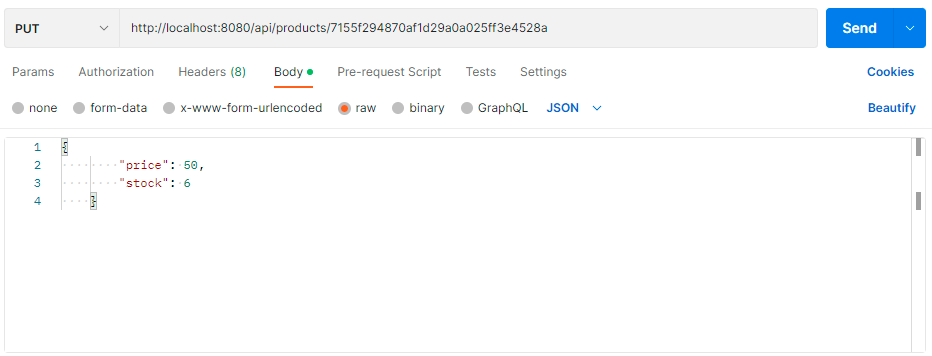

## Se entrega primera pre-entrega para revision por parte del tutor.

### iniciar servidor: nodemon app.js

### Se usa md5 para generar un hash. En "products" se usa el nombre del producto y en "carts" se usa la fecha actual.
### Mas adelante se caracterizara al usuario y al carrito para generar el hash md5

### /api/carts/28faf80de068fa11268773347ef73a62/product/7155f294870af1d29a0a025ff3e4528a

